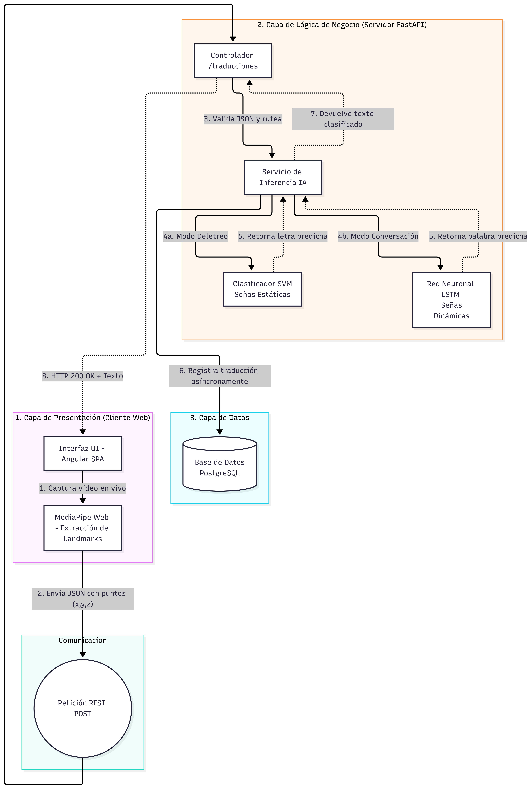

# SeñaCL - Traductor de Lengua de Señas Chilena

**Promesa del producto:** Entregar una traducción automática, unidireccional y en tiempo real de la Lengua de Señas Chilena (LSCh) a texto y audio mediante una aplicación web de fácil acceso.

## Equipo de Desarrollo
*   **Javier Ignacio Concha** - [@UsuarioJavier](https://github.com/a3rshH)
*   **Luis Jesús Urbina Garcidueñas** - [@UsuarioLuis](https://github.com/LuisU1138)
*   **Juan Carlos Vega Graterol** - [@UsuarioJuan](https://github.com/ju4n0ff)

## Entregables del Hito 1

### Prototipo Navegable
*   [Abrir Prototipo Interactivo (Clic aquí)](#) *(Nota: Insertar aquí el enlace público)*

### Documentación Técnica
Los siguientes documentos se encuentran alojados en la carpeta `docs/` de este repositorio:

*   [Documento de Propuesta (PDF)](./docs/Documento_Propuesta.pdf)
*   [Láminas de Presentación (PDF)](./docs/PptSeñascl.pdf)
*   [Mapa del Producto (PNG)](./docs/Mapa_Producto.png)
  
